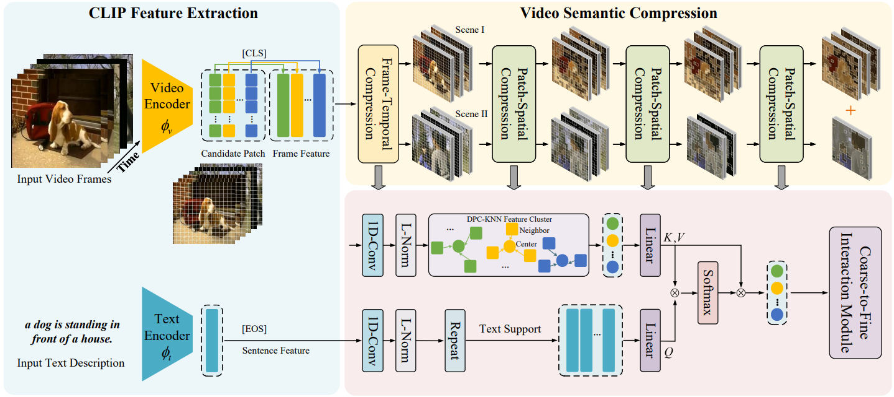
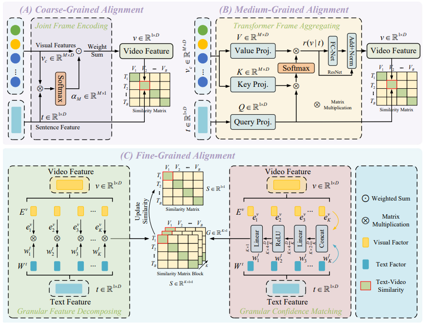
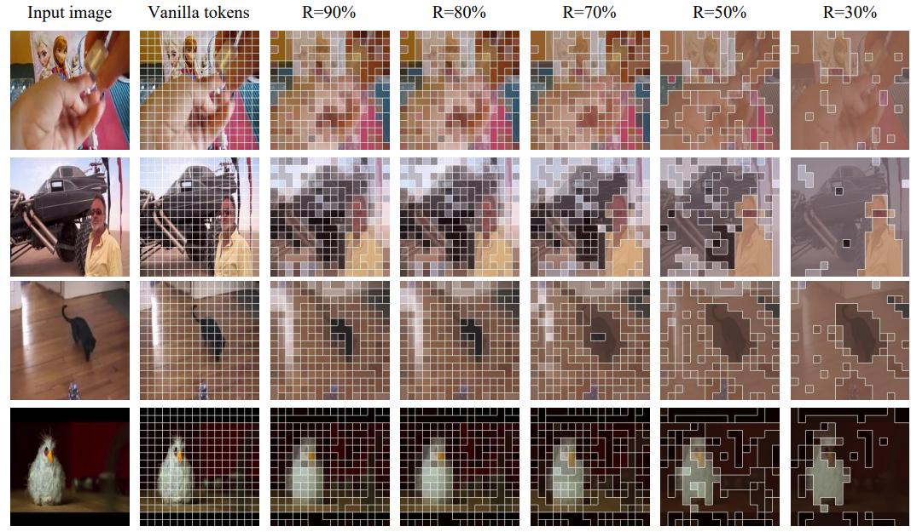
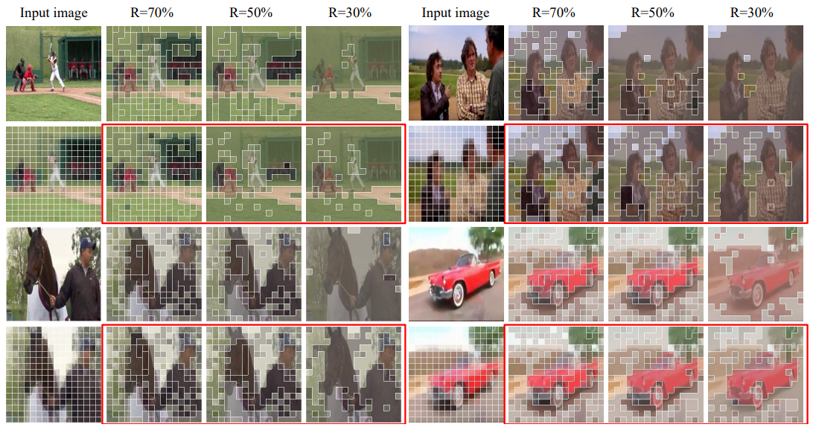

<div align="left">
  
# 💡V-Sparse: Temporal-Spatial Visual Compression and Coarse-to Fine Alignment for Text-Video Retrieval

## 📣 Updates
* **[2025/01/18]**: We have released the complete training and testing code.

## ⚡ Framework

#### Video Semantic Compression Framework
<div align="center">
  
</div>

#### Coarse-to-Fine Alignment Framework
<div align="center">
  
</div>

## 😍 Visualization

#### Example 1
<div align=center>

</div>

#### Example 2
<div align=center>

</div>

## 🚀 Quick Start
### Setup

#### Setup code environment
```shell
conda create -n V-Sparse python=3.8
conda activate V-Sparse
pip install -r requirements.txt
pip install torch torchvision torchaudio --index-url https://download.pytorch.org/whl/cu118
```

#### Download CLIP Model


```shell
cd V-Sparse/models
wget https://openaipublic.azureedge.net/clip/models/40d365715913c9da98579312b702a82c18be219cc2a73407c4526f58eba950af/ViT-B-32.pt
# wget https://openaipublic.azureedge.net/clip/models/5806e77cd80f8b59890b7e101eabd078d9fb84e6937f9e85e4ecb61988df416f/ViT-B-16.pt
# wget https://openaipublic.azureedge.net/clip/models/b8cca3fd41ae0c99ba7e8951adf17d267cdb84cd88be6f7c2e0eca1737a03836/ViT-L-14.pt
```

#### Download Datasets

<div align=center>

|       Datasets        |                             Download Link                              |
|:---------------------:|:----------------------------------------------------------------------:|
|        MSRVTT         |      [Download](http://ms-multimedia-challenge.com/2017/dataset)       |  
|         MSVD          | [Download](https://www.cs.utexas.edu/users/ml/clamp/videoDescription/) | 
| ActivityNet |           [Download](http://activity-net.org/download.html)            | 
| Charades |         [Download](https://github.com/activitynet/ActivityNet)         |  
| DiDeMo |       [Download](https://github.com/LisaAnne/LocalizingMoments)        | 
| VATEX |                              [Download](https://eric-xw.github.io/vatex-website/download.html)                              | 

</div>

### Text-Video Retrieval
#### 💪 Training
Run the following training code to resume the above results. Take MSRVTT as an example.
```shell
CUDA_VISIBLE_DEVICES=0 \
python -m torch.distributed.launch \
--master_port 2502 \
--nproc_per_node=1 \
main_retrieval.py \
--do_train 1 \
--workers 8 \
--n_display 100 \
--epochs 5 \
--lr 1e-4 \
--coef_lr 1e-3 \
--batch_size 32 \
--batch_size_val 32 \
--anno_path MSRVTT \
--video_path MSRVTT/videos \
--datatype msrvtt \
--max_words 24 \
--max_frames 12 \
--video_framerate 1 \
--split_batch 8 \
--output_dir experiments/MSRVTT
```

#### Testing
```shell
CUDA_VISIBLE_DEVICES=0 \
python -m torch.distributed.launch \
--master_port 2502 \
--nproc_per_node=1 \
main_retrieval.py \
--do_eval 1 \
--workers 8 \
--n_display 100 \
--epochs 5 \
--lr 1e-4 \
--coef_lr 1e-3 \
--batch_size 32 \
--batch_size_val 32 \
--anno_path MSRVTT \
--video_path MSRVTT/videos \
--datatype msrvtt \
--max_words 24 \
--max_frames 12 \
--video_framerate 1 \
--split_batch 8 \
--output_dir experiments/MSRVTT \
--init_model ${CHECKPOINT_PATH} 
```

### Video Question Answering
The code for this module refers to the directory V-Sparse/VQA.
```shell
CUDA_VISIBLE_DEVICES=0 \
python -m torch.distributed.launch \
--master_port 2502 \
--nproc_per_node=1 \
main_vqa.py \
--do_train \
--num_thread_reader=8 \
--epochs=5 \
--batch_size=8 \
--n_display=100 \
--train_csv MSRVTT/train.jsonl \
--val_csv MSRVTT/test.jsonl \
--data_path MSRVTT/train_ans2label.json \
--features_path MARVTT/videos \
--lr 1e-4 \
--max_words 24 \
--max_frames 12 \
--batch_size_val 8 \
--datatype msrvtt \
--expand_msrvtt_sentences \
--feature_framerate 1 \
--coef_lr 1e-3 \
--freeze_layer_num 0  \
--slice_framepos 2 \
--linear_patch 2d \
--output_dir experiments
```


## 🎗️ Acknowledgments
Our code is based on [CLIP4Clip](https://github.com/ArrowLuo/CLIP4Clip/), [X-Pool](https://github.com/layer6ai-labs/xpool), [HBI](https://github.com/jpthu17/HBI/tree/main). We sincerely appreciate for their contributions.