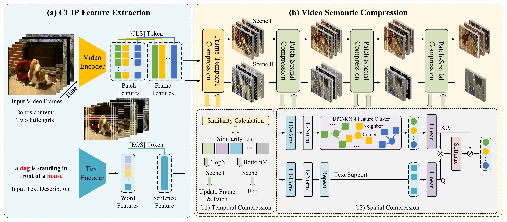
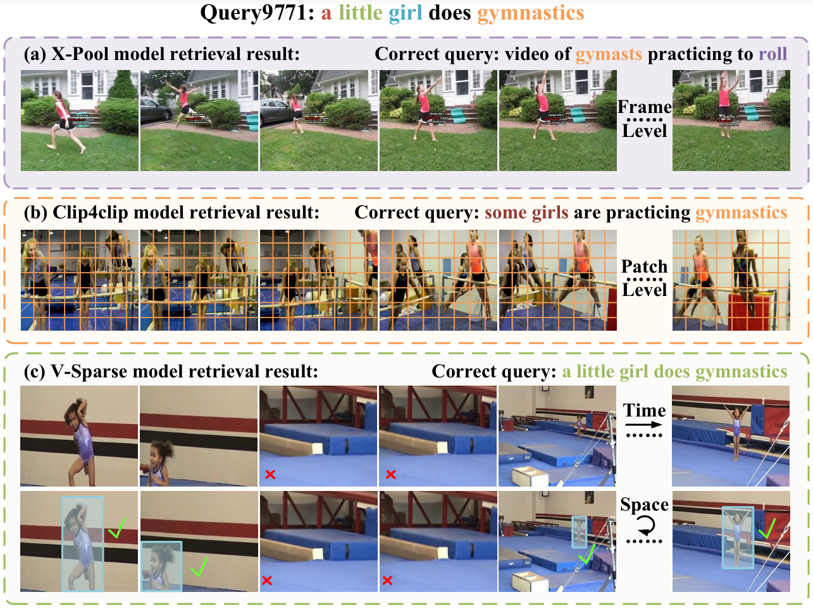
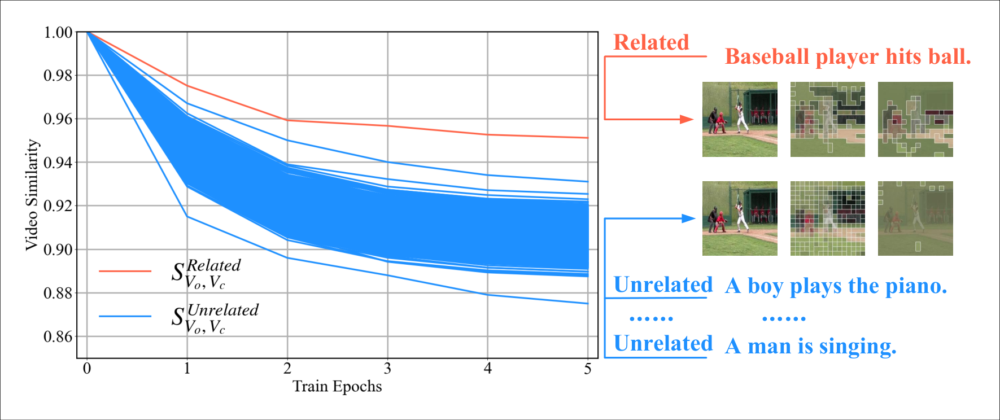
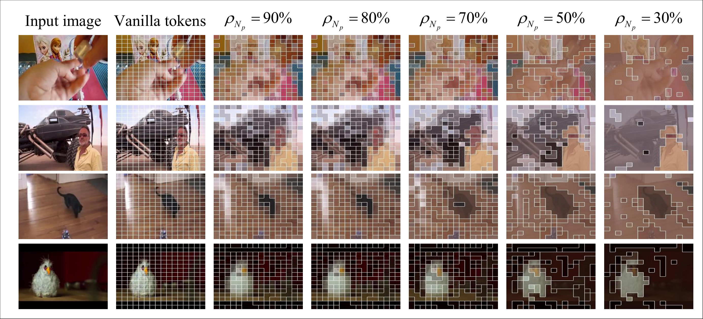

<div align="center">

# From temporal-spatial visual semantic compression to coarse-to-fine interaction for text-video retrieval

[](https://www.python.org/downloads/release/python-3100/)
[](https://pytorch.org/)
[](LICENSE)

**Accepted by Neural Networks 🎉**

</div>

## 📋 Overview

We propose a novel text-video retrieval model, named **V-Sparse**, which addresses the inherent imbalance in cross-modal matching through two core components:

- **Visual Semantic Compression (VSC)**: A text-guided module that reduces feature redundancy via Temporal (**TVSC**) frame-level and Spatial (**SVSC**) patch-level compression, providing precision support for subsequent cross-modal interaction.

- **Coarse-to-Fine Interaction (CFI)**: A multi-granularity alignment module that jointly aligns sentences with frames, sentences with patches, and words with patches from a unified feature encoding perspective.

- **Synergistic Design**: VSC enhances feature representation while CFI enables effective feature interaction, jointly facilitating cross-modal text-video alignment and greatly mitigating the inherent imbalance in modal pairing.

- **State-of-the-art Performance**: Achieves superior results on six benchmark datasets in both long-video and short-text retrieval tasks.

- **Insightful Ablations**: Extensive experiments demonstrate the importance of feature compression in cross-modal interaction, offering an effective intermediate pathway for modality interaction.

### Key Features

- 🚀 **Efficient Spatial Clustering**: Progressive compression of video patch tokens using DPC-KNN density peak clustering
- 🎯 **Multi-Level Interaction**: Three complementary interaction modes (global, local, fine-grained)
- 🔄 **Dual-Branch Architecture**: Low-resolution and high-resolution branches with KL alignment
- ⚡ **Optimized Training**: BertAdam optimizer with differentiated learning rates for CLIP and non-CLIP modules
- 🌐 **Distributed Training**: Full support for multi-GPU training with DDP

## 📣 Updates

- **[2025/01/18]**: We have released the complete training and testing code.
- **[2025/01/20]**: The paper has been submitted to the journal Neural Networks.
- **[2026/04/10]**: Paper accepted by the journal Neural Networks.

## 🗂️ Project Structure

```
V-Sparse/
├── main_retrieval.py              # Main entry point for training & evaluation
├── requirements.txt               # Python dependencies
├── models/
│   ├── __init__.py
│   ├── modeling.py                # Core V-Sparse model (CLIP encoder + dual-branch + multi-level interaction)
│   ├── cluster.py                 # PCM module variant
│   ├── cluster_.py                # Progressive Clustering Module (PCM) & cross-attention
│   ├── module_clip.py             # CLIP vision/language encoder
│   ├── module_cross.py            # Transformer blocks for cross-modal interaction
│   ├── module_transformer.py      # Transformer utilities
│   ├── optimization.py            # BertAdam optimizer with warmup cosine annealing
│   ├── tokenization_clip.py       # CLIP text tokenizer
│   ├── until_config.py            # Model configuration utilities
│   ├── until_module.py            # Utility modules (LayerNorm, AllGather, CrossEn, KL)
│   ├── file_utils.py              # File I/O helpers
│   ├── cross-base/
│   │   └── cross_config.json      # Cross-modal Transformer config
│   └── bpe_simple_vocab_16e6.txt.gz  # BPE vocabulary for tokenization
├── dataloaders/
│   ├── __init__.py
│   ├── data_dataloaders.py        # DataLoader registry & collate functions
│   ├── dataloader_msrvtt_retrieval.py   # MSRVTT dataset loader
│   ├── dataloader_didemo_retrieval.py   # DiDeMo dataset loader
│   ├── dataloader_charades_retrieval.py # Charades dataset loader
│   ├── dataloader_retrieval.py    # Base retrieval dataset class
│   ├── rawvideo_util.py           # Raw video reading utilities
│   ├── video_transforms.py        # Video augmentation transforms
│   ├── random_erasing.py          # Random erasing augmentation
│   ├── rand_augment.py            # RandAugment policy
│   └── functional.py              # Functional transform helpers
├── utils/
│   ├── __init__.py
│   ├── metrics.py                 # Retrieval evaluation metrics (R@K, MdR, MnR)
│   ├── metrics_qa.py              # QA-specific evaluation metrics
│   ├── logger.py                  # Logging utilities
│   ├── metric_logger.py           # Metric logging & smoothing
│   ├── util.py                    # General utility functions
│   └── comm.py                    # Distributed communication helpers
├── script/
│   ├── run_MSRVTT.sh              # Training & eval script for MSRVTT
│   ├── run_DiDeMo.sh              # Training & eval script for DiDeMo
│   ├── run_Charades.sh            # Training & eval script for Charades
│   └── run_test.sh                # Quick test script
├── preprocess/
│   └── compress_video.py          # Video preprocessing & compression
├── docs/                          # Paper & supplementary materials
│   ├── V-Sparse.pdf
│   ├── V-Sparse-Author-Responses.docx
│   ├── framework.pdf
│   ├── motivation.pdf
│   ├── svsc.pdf
│   └── video_similarity.pdf
├── experiments/                   # Output directory for logs & checkpoints
│   └── MSRVTT/                    # Per-dataset experiment outputs
│       └── <timestamp>/           # Timestamped run directories
│           └── log.txt            # Training & evaluation log
└── figures/                       # Motivation & framework diagrams
    ├── framework.png
    ├── motivation.png
    ├── svsc.png
    └── video_similarity.png
```

## ⚡ Framework

> See **Figure 1** in the [Visualization](#-visualization) section for the full architecture diagram.

### Architecture Overview

V-Sparse follows a four-stage pipeline for text-video retrieval:

1. **Multi-Granularity Feature Extraction**: Extract multi-granularity text and video features via CLIP encoder:
   - **Text**: sentence-level features `[a, d]` and word-level features `[a, w, d]`
   - **Video**: frame-level features `[b, f, d]` and patch-level features `[b, p, d]`

2. **Dual-Branch Processing**:
   - **Low-Resolution Branch**: Retain original coarse frame and patch features as-is
   - **Visual Feature Compact**: Select top-k query-relevant frames using diagonal-slice query-frame similarity
   - **High-Resolution Branch**: Apply ActionFlow module (3-layer PCM + Cross-Attention) on compacted patches

3. **Multi-Level Spatial Interaction**:
   - **Global (qs-vf)**: Query sentence ↔ video frame matching
   - **Local (qw-vf)**: Query word ↔ video frame matching
   - **Fine-grained (qw-vp)**: Query word ↔ video patch matching

4. **Loss Computation**:
   - **Symmetric Contrastive Loss**: Bidirectional cross-entropy over multi-level similarities
   - **KL Alignment Loss**: Aligns similarity distributions between low-resolution and high-resolution branches

### Dual-Branch Architecture

V-Sparse employs a dual-branch design for robust feature learning:

```
Input Video → CLIP Encoder → Frame/Patch Features
                                    ↓
                        ┌─────────────────────────────┐
                        │     Low-Resolution Branch    │
                        │   (Original frame/patch      │
                        │    features, no PCM)         │
                        └─────────────────────────────┘
                                    ↓
                        ┌─────────────────────────────┐
                        │  Visual Feature Compact      │
                        │  (Select top-k relevant      │
                        │   frames based on query)     │
                        └─────────────────────────────┘
                                    ↓
                        ┌─────────────────────────────┐
                        │     High-Resolution Branch   │
                        │  (3-layer PCM + Cross-Att)   │
                        │  ActionFlow Module           │
                        └─────────────────────────────┘
                                    ↓
                        ┌─────────────────────────────┐
                        │     KL Alignment Loss        │
                        │  (Align branch distributions)│
                        └─────────────────────────────┘
```

**ActionFlow Module**: The core innovation that progressively compresses video patch tokens:
1. **PCM Layer 1**: Compress patches from N to N×0.5 tokens
2. **Cross-Attention**: Text queries attend to compressed visual tokens
3. **PCM Layer 2**: Further compress to N×0.25 tokens
4. **Cross-Attention**: Text-guided refinement
5. **PCM Layer 3**: Final compression to N×0.125 tokens
6. **Cross-Attention**: Final text-visual interaction

This progressive compression reduces computational complexity while preserving spatial information through text-guided attention.

## 😍 Visualization

<table>
<tr>
<td align="center" width="60%">
  
</td>
<td width="40%">

**Figure 1: Overall Architecture.**

**(a) CLIP Feature Extraction** — Extracts multi-granularity features: sentence/word-level text features and frame/patch-level video features.

**(b) Video Semantic Compression (VSC):**
- **(b1) Temporal Compression** — Selects top-N query-relevant frames via similarity scoring; merges bottom-M frames into scene-level summaries.
- **(b2) Spatial Compression** — Progressively merges patch tokens within each frame using DPC-KNN density peak clustering with text-guided attention, reducing spatial redundancy while preserving semantic content.

</td>
</tr>
</table>

<br/>

<table>
<tr>
<td align="center" width="60%">
  
</td>
<td width="40%">

**Figure 2: Motivation.**

Comparison of retrieval results for the query *"a little girl does gymnastics"* (Query 9771):

- **(a) X-Pool** — Frame-level matching; retrieves an incorrect video (a girl running outdoors).
- **(b) Clip4Clip** — Patch-level matching; retrieves a mismatched video (women at a ballet barre).
- **(c) V-Sparse** — Joint temporal-spatial selection; successfully retrieves the correct video (a girl performing gymnastics on a mat).

</td>
</tr>
</table>

<br/>

<table>
<tr>
<td align="center" width="60%">
  
</td>
<td width="40%">

**Figure 3: Inter-Video Similarity Analysis.**

Cosine similarity between a video and related/unrelated captions across training epochs:

- **Red curve** (S<sup>Related</sup><sub>Vo,Vc</sub>) — Stays high (~0.95) for semantically related pairs (e.g., *"Baseball player hits ball"*).
- **Blue curves** (S<sup>Unrelated</sup><sub>Vo,Vc</sub>) — Decrease from ~1.00 to ~0.88–0.93 for unrelated pairs (e.g., *"A boy plays the piano"*), showing the model learns to distinguish related from unrelated content.

</td>
</tr>
</table>

<br/>

<table>
<tr>
<td align="center" width="60%">
  
</td>
<td width="40%">

**Figure 4: SVSC Compression Visualization.**

Spatial Video Semantic Compression at different compression ratios (ρ<sub>N<sub>p</sub></sub>):

- **Column 1** — Original input image.
- **Column 2** — Vanilla uniform patch tokens.
- **Columns 3–7** — Clustering results at ρ = 90%, 80%, 70%, 50%, 30%. White outlines indicate cluster boundaries.

As ρ decreases, semantically meaningful regions (e.g., the duck, the car, the cat) are preserved as coherent clusters while background patches are merged, demonstrating effective retention of task-relevant spatial information under aggressive compression.

</td>
</tr>
</table>

## 🚀 Quick Start

### 1. Environment Setup

```bash
# Create conda environment
conda create -n vsparse python=3.10
conda activate vsparse

# Install PyTorch (choose the appropriate CUDA version)
pip install torch torchvision

# Install dependencies
pip install -r requirements.txt

# Install additional packages
pip install thop  # For model FLOPs computation
```

### 2. Data Preparation

Download the following datasets and organize them as shown:

```
data/
├── MSRVTT/
│   ├── anns/              # Annotation files
│   │   ├── MSRVTT_train.9000.csv
│   │   ├── MSRVTT_test.1000.csv
│   │   └── MSRVTT_data.json
│   └── videos/            # Video files (.mp4)
├── DiDeMo/
│   ├── anns/
│   └── videos/
└── Charades/
    ├── anns/
    └── videos/
```

### 3. Pretrained Weights

Place CLIP pretrained weights in the `models/` directory:
- `ViT-B/32` → `models/ViT-B-32.pt`
- `ViT-B/16` → `models/ViT-B-16.pt`

These can be downloaded from the [official CLIP repository](https://github.com/openai/CLIP).

### 4. Video Preprocessing (Optional)

If you need to preprocess videos for faster loading:

```bash
python preprocess/compress_video.py \
    --input_root /path/to/original/videos \
    --output_root /path/to/compressed/videos
```

This will:
- Resize videos to 224px resolution
- Compress to 3 FPS for faster loading
- Use multiprocessing for parallel processing

**Preprocessing Benefits:**
- Reduces video file sizes by 80-90%
- Speeds up video loading by 3-5x
- Maintains visual quality for retrieval tasks
- Uses all available CPU cores for parallel processing

### 5. Training

```bash
# Train on MSRVTT (single GPU)
bash script/run_MSRVTT.sh

# Train on DiDeMo
bash script/run_DiDeMo.sh

# Train on Charades
bash script/run_Charades.sh
```

**Multi-GPU Training** (e.g., 4 GPUs):
```bash
# Edit script/run_MSRVTT.sh and set GPU="0,1,2,3"
GPU="0,1,2,3" bash script/run_MSRVTT.sh
```

**Training Process:**
1. **Zero-shot Evaluation**: Evaluate CLIP baseline before training
2. **Epoch Training**: 5 epochs with BertAdam optimizer
3. **Evaluation**: After each epoch, evaluate on test set
4. **Checkpointing**: Save best model based on R@1 score
5. **Final Evaluation**: Reload best checkpoint for final results

**Optimizer Configuration:**
- **BertAdam**: Adam with bias correction and warmup
- **4 Parameter Groups**: Differentiated learning rates for CLIP and non-CLIP modules
- **Warmup**: 10% of total steps with linear warmup
- **Schedule**: Warmup cosine annealing

**Command Line Arguments:**
```bash
CUDA_VISIBLE_DEVICES=0 python -m torch.distributed.launch \
    --master_port 2502 --nproc_per_node=1 main_retrieval.py \
    --do_train 1 \
    --do_eval 1 \
    --datatype msrvtt \
    --anno_path MSRVTT \
    --video_path MSRVTT/videos \
    --base_encoder ViT-B/32 \
    --agg_module seqTransf \
    --num_hidden_layers 4 \
    --max_words 24 \
    --max_frames 12 \
    --lr 1e-4 \
    --coef_lr 1e-3 \
    --epochs 5 \
    --batch_size 32 \
    --output_dir experiments/MSRVTT
```

### 6. Evaluation

```bash
# Evaluate on MSRVTT
bash script/run_test.sh

# Or run evaluation directly
CUDA_VISIBLE_DEVICES=0 python -m torch.distributed.launch \
    --master_port 2502 --nproc_per_node=1 main_retrieval.py \
    --do_eval 1 \
    --init_model path/to/best.pth \
    --datatype msrvtt \
    --anno_path MSRVTT \
    --video_path MSRVTT/videos \
    --output_dir experiments/MSRVTT
```

**Evaluation Output:**
The evaluation will output the following metrics:
- **R@1, R@5, R@10**: Recall at different ranks
- **MdR**: Median Rank
- **MnR**: Mean Rank
- **RSum**: Sum of R@1 + R@5 + R@10

**Evaluation Process:**
1. Load the trained model checkpoint
2. Extract features for all test queries and videos
3. Compute similarity scores
4. Rank videos for each query (and vice versa)
5. Calculate retrieval metrics

### Key Arguments

| Argument | Default | Description |
|----------|---------|-------------|
| `--datatype` | `msrvtt` | Dataset: `msrvtt` / `charades` / `didemo` |
| `--base_encoder` | `ViT-B/32` | CLIP backbone: `ViT-B/32` / `ViT-B/16` |
| `--agg_module` | `seqTransf` | Temporal aggregation: `None` / `seqLSTM` / `seqTransf` |
| `--num_hidden_layers` | `4` | Number of Transformer layers in the video branch |
| `--max_words` | `32` | Maximum text tokens per query |
| `--max_frames` | `12` | Maximum sampled video frames |
| `--save_frames` | `6` | Frames retained after compact (`max_frames // 2`) |
| `--epochs` | `5` | Total training epochs |
| `--lr` | `1e-4` | Learning rate for non-CLIP modules |
| `--coef_lr` | `1e-3` | LR coefficient for the CLIP branch |
| `--batch_size` | `32` | Training batch size |
| `--batch_size_val` | `32` | Evaluation batch size |
| `--split_batch` | `32` | Split batch for evaluation to prevent OOM |
| `--workers` | `4` | Number of data loading workers |
| `--seed` | `42` | Random seed for reproducibility |

## 🔧 Key Components

### 1. Progressive Clustering Module (PCM)

The PCM module performs dynamic token compression with the following steps:

1. **Token Convolution**: 1D convolution for local feature transformation
2. **Importance Scoring**: Linear layer predicts per-token importance score `[B, N, 1]`
3. **Weight Conversion**: Convert scores to non-negative aggregation weights via exponential
4. **DPC-KNN Clustering**: Density peak clustering with K-nearest neighbors
5. **Canonical Merge**: Max-reduction merging within clusters (HV communication semantics)

```python
# Example PCM usage
pcm = PCM(sample_ratio=0.5, k=3)
downsampled_dict = pcm(token_dict)
```

### 2. Cross-Attention Block (Cross_Att_Block_Patch)

Text-guided visual token attention with mismatched dimensions:

- **Query**: Text word features `[B, Nq, dim_q]` (e.g., `[B, 24, 512]`)
- **Key/Value**: Video patch features `[B, Nkv, dim_kv]` (e.g., `[B, 588, 512]`)
- **Special Case**: If Nq == 1 (sentence-level feature), it is broadcast to match Nkv
- **Token Score Bias**: Uses PCM's importance score as confidence bias in attention logits
- **Mask Handling**: Both query and key/value masks are properly applied

```python
# Example cross-attention usage
cross_att = Cross_Att_Block_Patch(dim=512)
kv_dict = cross_att(qw_token_dict, vp_token_dict)
```

### 3. Multi-Level Similarity Computation

Three complementary interaction modes with symmetric attention:

- **qs-vf (Global)**: Query sentence ↔ video frame matching
  - Direction 1: qs → vf (max over frames)
  - Direction 2: vf → qs (weighted aggregation)
  
- **qw-vf (Local)**: Query word ↔ video frame matching
  - Direction 1: qw → vf (max over frames, then word-weighted)
  - Direction 2: vf → qw (max over words, then frame-weighted)
  
- **qw-vp (Fine-grained)**: Query word ↔ video patch matching
  - Direction 1: qw → vp (max over patches, then word-weighted)
  - Direction 2: vp → qw (max over words, then patch-weighted)

Each mode uses learnable aggregation weights with softmax normalization.

### 4. Visual Feature Compact

Selects the most query-relevant frames for high-resolution branch:

1. **Query-Frame Similarity**: Compute diagonal-slice similarity between query sentences and video frames
2. **Softmax Normalization**: Normalize similarity scores over frames
3. **Top-k Selection**: Select `save_frames = max_frames // 2` most relevant frames
4. **Patch Gathering**: Gather corresponding patches for the selected frames

### 5. KL Alignment Loss

Aligns similarity distributions between low-resolution and high-resolution branches:

```python
# Bidirectional KL divergence
loss_kl = (KL(sims_l, sims_h) + KL(sims_l.T, sims_h.T) +
           KL(sims_h, sims_l) + KL(sims_h.T, sims_l.T)) / 4.0
```

This ensures both branches produce consistent similarity distributions.

## 🧪 Experiments

### Model Statistics

| Metric | Value |
|--------|-------|
| Total Parameters | 171.55M |
| Trainable Parameters | 169.19M |
| GPU Memory Usage | ~10.57 GB |
| Training Time (MSRVTT) | 06h 27min 07s (single GPU) |
| Inference Speed | ~30s per 1,000 samples |
| Train Examples | 180,000 |
| Test Examples | 1,000 |
| Steps per Epoch | 5,625 |
| Total Training Steps | 28,125 |

### Zero-shot Evaluation

**Text → Video Retrieval:**

| R@1 | R@5 | R@10 | R@Sum | MdR | MnR |
|-----|-----|------|-------|-----|-----|
| 34.4 | 59.1 | 69.5 | 163.0 | 3.0 | 27.1 |

**Video → Text Retrieval:**

| R@1 | R@5 | R@10 | R@Sum | MdR | MnR |
|-----|-----|------|-------|-----|-----|
| 35.6 | 60.3 | 68.9 | 164.7 | 3.0 | 25.5 |

### Training Progress

| Epoch | T→V R@1 | T→V R@5 | T→V R@10 | T→V R@Sum | V→T R@1 | V→T R@5 | V→T R@10 | V→T R@Sum |
|-------|---------|---------|----------|-----------|---------|---------|----------|-----------|
| 1 | 46.3 | 75.1 | 83.9 | 205.3 | 48.2 | 74.9 | 85.0 | 208.1 |
| 2 | 48.6 | 75.7 | 85.1 | 209.4 | 47.8 | 75.3 | 83.5 | 206.6 |
| 3 | 49.2 | 76.8 | 86.2 | 212.2 | 51.2 | 77.1 | 85.1 | 213.3 |
| 4 | 50.4 | 76.2 | 85.1 | 211.7 | 49.9 | 76.4 | 84.9 | 211.2 |
| 5 (Best) | **50.9** | **75.9** | **85.5** | **212.3** | **50.7** | **76.6** | **84.5** | **211.8** |

### Final Evaluation

**Text → Video Retrieval:**

| R@1 | R@5 | R@10 | R@Sum | MdR | MnR |
|-----|-----|------|-------|-----|-----|
| 50.9 | 75.9 | 85.5 | 212.3 | 1.0 | 11.3 |

**Video → Text Retrieval:**

| R@1 | R@5 | R@10 | R@Sum | MdR | MnR |
|-----|-----|------|-------|-----|-----|
| 50.7 | 76.6 | 84.5 | 211.8 | 1.0 | 9.4 |

### Dataset Statistics

| Dataset | Train Videos | Test Videos | Captions | Task |
|---------|--------------|-------------|----------|------|
| MSRVTT | 9,000 | 1,000 | 200,000 | Video-to-Text Retrieval |
| DiDeMo | 8,543 | 1,045 | 42,729 | Temporal Video Grounding |
| Charades | 12,468 | 1,841 | 53,397 | Activity Recognition |

For detailed results on DiDeMo and Charades, please refer to our paper.

### Model Configuration

| Category | Parameter | Default | Description |
|----------|-----------|---------|-------------|
| Architecture | `base_encoder` | `ViT-B/32` | CLIP backbone variant |
| Architecture | `agg_module` | `seqTransf` | Temporal aggregation module (`None` / `seqLSTM` / `seqTransf`) |
| Architecture | `num_hidden_layers` | `4` | Transformer layers in video branch |
| Architecture | `sample_ratio` | `0.5` | PCM token compression ratio (per layer) |
| Architecture | `k` | `3` | KNN neighbors for DPC-KNN |
| Input | `max_words` | `32` | Maximum text tokens per query |
| Input | `max_frames` | `12` | Maximum sampled video frames |
| Input | `save_frames` | `6` | Frames retained after compact (`max_frames // 2`) |
| Training | `lr` | `1e-4` | Learning rate for non-CLIP modules |
| Training | `coef_lr` | `1e-3` | LR coefficient for CLIP branch |
| Training | `weight_decay` | `0.2` | Weight decay coefficient |
| Training | `warmup_proportion` | `0.1` | Warmup proportion |
| Training | `epochs` | `5` | Total training epochs |
| Training | `batch_size` | `32` | Training batch size |
| Training | `alpha` | `0.5` | High-resolution loss weight |
| Training | `beta` | `0.1` | Low-resolution loss weight |
| Training | `gamma` | `0.01` | KL alignment loss weight |

### Loss Function

The total loss combines three components:

1. **High-resolution contrastive loss**: `loss_h`
   - Computed on features from high-resolution branch (ActionFlow output)
   - Symmetric cross-entropy over qs-vf, qw-vf, qw-vp similarities

2. **Low-resolution contrastive loss**: `loss_l`
   - Computed on original (unprocessed) frame/patch features
   - Same three similarity modes as high-resolution branch

3. **KL alignment loss**: `loss_kl`
   - Bidirectional KL divergence between low-resolution and high-resolution similarity distributions
   - Aligns both row and column directions

```
total_loss = loss_h + loss_l + loss_kl
```

### Feature Dimensions

| Feature | Shape | Description |
|---------|-------|-------------|
| `qs_feat` | `[a, d]` | Query sentence features (CLIP [CLS] token) |
| `qw_feat` | `[a, w, d]` | Query word features (CLIP hidden states) |
| `vf_feat` | `[b, f, d]` | Video frame features (CLIP [CLS] tokens) |
| `vp_feat` | `[b, p, d]` | Video patch features (CLIP hidden states) |
| `vp_feat_h` | `[b, h, d]` | High-resolution frame features (after compact) |
| `vp_feat_` | `[b, p', d]` | ActionFlow output (3-layer concatenated patches) |

Where: `a` = batch size, `w` = max words, `f` = max frames, `p` = frames × patches per frame (e.g., 12×49=588), `d` = embed dim (512)

### Progressive Compression Benefits

The ActionFlow module reduces computational complexity through 3-layer progressive compression:

```
Original patches: 12 frames × 49 patches/frame = 588 patches
After PCM Layer 1: 588 × 0.5 = 294 patches
After PCM Layer 2: 294 × 0.5 = 147 patches
After PCM Layer 3: 147 × 0.5 = 74 patches (final)
```

This **87.5% reduction** in patch tokens significantly reduces attention computation while preserving spatial information through text-guided clustering.

## 🎗️ Acknowledgments

This project is built upon [CLIP](https://github.com/openai/CLIP) and several excellent open-source projects. We thank the authors for releasing their code.

**Key Dependencies:**
- [CLIP](https://github.com/openai/CLIP): Contrastive Language-Image Pre-training
- [PyTorch](https://pytorch.org/): Deep learning framework
- [transformers](https://github.com/huggingface/transformers): Hugging Face transformers
- [decord](https://github.com/dmlc/decord): Video loading library
- [timm](https://github.com/rwightman/pytorch-image-models): PyTorch Image Models

## 📚 Citation

If you find this work useful, please cite our paper:

```bibtex
@article{liu2026vsparse,
  title   = {V-Sparse: From temporal-spatial visual semantic compression to coarse-to-fine interaction for text-video retrieval},
  author  = {Liu, Xin and Yin, Shibai and Wang, Jun and Li, Wei and Wang, Xingyang and Zhu, Jiaxin and Shen, Yubing and Yang, Yee-Hong},
  journal = {Neural Networks},
  volume  = {201},
  pages   = {108982},
  year    = {2026},
  doi     = {10.1016/j.neunet.2026.108982}
}
```

## 📬 Contact

If you have any questions, feel free to reach out:

- **Issues**: For bug reports, feature requests, or general questions, please open a [GitHub Issue](https://github.com/OPA067/V-Sparse/issues).
- **Email**: `xinl067@163.com`

We welcome contributions and suggestions!

## 📄 License

This project is released for academic research use only.

## 🤝 Contributing

We welcome contributions! Please feel free to submit issues and pull requests.

**How to Contribute:**
1. **Fork** the repository
2. **Create** a feature branch (`git checkout -b feature/amazing-feature`)
3. **Commit** your changes (`git commit -m 'Add amazing feature'`)
4. **Push** to the branch (`git push origin feature/amazing-feature`)
5. **Open** a Pull Request

**Contribution Guidelines:**
- Follow the existing code style
- Add comments for complex logic
- Update documentation if needed
- Test your changes before submitting

## 🛠️ Troubleshooting

### Common Issues

**1. CUDA Out of Memory**
```bash
# Reduce batch size
--batch_size 16
--batch_size_val 16

# Or reduce max_frames
--max_frames 8

# Or reduce split_batch for evaluation
--split_batch 16
```

**2. Video Loading Errors**
```bash
# Ensure videos are in correct format
# Check if video files exist
ls /path/to/videos/*.mp4

# Use video preprocessing for faster loading
python preprocess/compress_video.py \
    --input_root /path/to/original \
    --output_root /path/to/compressed
```

**3. Distributed Training Issues**
```bash
# Check GPU availability
nvidia-smi

# Ensure master_port is available
--master_port 2502

# Use gloo backend for compatibility
torch.distributed.init_process_group(backend="gloo")
```

**4. Memory Issues During Evaluation**
```bash
# Reduce split_batch to prevent OOM
--split_batch 16

# Or use smaller batch_size_val
--batch_size_val 16
```

**5. Import Errors**
```bash
# Install missing dependencies
pip install -r requirements.txt
pip install thop

# Check Python version
python --version  # Should be 3.10+

# Check PyTorch installation
python -c "import torch; print(torch.__version__)"
```

**6. Model Loading Errors**
```bash
# Ensure CLIP weights are in correct location
ls models/ViT-B-32.pt
ls models/ViT-B-16.pt

# Download from official CLIP repository if missing
# https://github.com/openai/CLIP
```

### Performance Tips

1. **Use SSD storage** for faster video loading
2. **Increase workers** for better I/O parallelism: `--workers 8`
3. **Use mixed precision** for faster training (if supported)
4. **Monitor GPU memory** during training to optimize batch size
5. **Use video preprocessing** to compress videos for faster loading

### Reproducibility

For reproducible results:
```bash
--seed 42  # Fixed random seed
torch.backends.cudnn.deterministic = True
torch.backends.cudnn.benchmark = False
```
